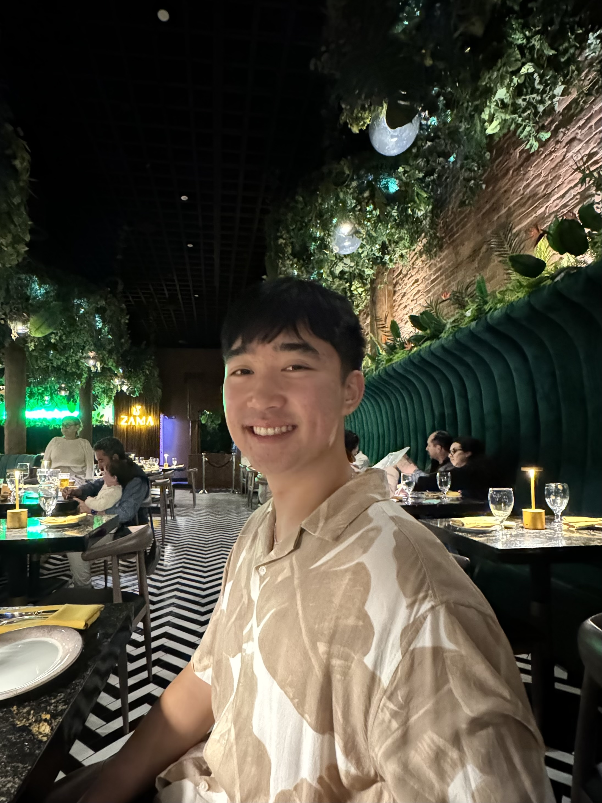

# Nathan's User Page

My name is **Nathan Chao**, I am a third year Computer Engineering student with a minor in business. I am originially from the San Gabriel Valley in LA, and my favorite food is rice. You can catch me spending most, if not all of my time: studying (*sad*), practicing/teaching Wushu (*happy*), or playing games (*variable lol*)

My favorite quote:
> Empty your mind, be formless. Shapeless, like water. If you put water into a cup, it becomes the cup. You put water into a bottle and it becomes the bottle.

In this page I will cover the following topics:
- [Nathan's User Page](#nathans-user-page)
  - [Who I am As a Programmer](#who-i-am-as-a-programmer)
  - [Who I am as a Person](#who-i-am-as-a-person)
  - [Goals for SPRING 2024](#goals-for-spring-2024)

## Who I am As a Programmer
My journey in programming began back in high school. I attended Don Bosco Technical Institute, where I spent four years in their Computer Science & Electrical Engineering department. I began with block coding and eventually moved up to the big boy stuff like C++, Android Studio, and Java. When I came to UCSD and took my first CSE course, it was in Python and I enjoyed it so much more. If I had to rank my top three programming languages it would be:

1. Python
2. HTML
3. Java

Python is so simple, and friendly, I mean who wouldn't wanna just type `print("Hello World")` over `System.out.println("Hello World!")`

To be completely honest, I enjoy the CS side of computer engineering much more than the elctrical/hardware side of the major. I hope to find something in the software engineering field once I graduate, or get into grad school to wait out the somewhat downturn of job openings. 

## Who I am as a Person
Outside of school, I spend my time either scrolling through Instagram/Youtube or practicing Wushu *(with a rare occurence of playing video games during school breaks)*.

I have been practicing martial arts for **17 years** now. 13 of those years was spent on a more traditional style known as Shaoling Kung Fu. The past 4 years, I have transitioned into Wushu, a more contemporary style of martial arts that is tuned as a competitive sport. My goal is to make the US team and I currently train at a school in Kearny Mesa, San Diego. It would be safe to say a large part of my identity outside of school revolves around Martial arts.  

You can find a video of my most recent competition [here](https://drive.google.com/file/d/1XXzHsUnkzd_yxxsBB1S2GNI1YVcFxOh2/view?usp=sharing).

This file holds a photo album as a way to highlight memories I make in 2024 [here](photoAlbum.md)

## Goals for SPRING 2024
- [ ] All-Around Champion at Golden State Wushu Championships in May
- [ ] Get into the ECE BS/MS program
- [ ] Successfully enter an internship with CalTrans